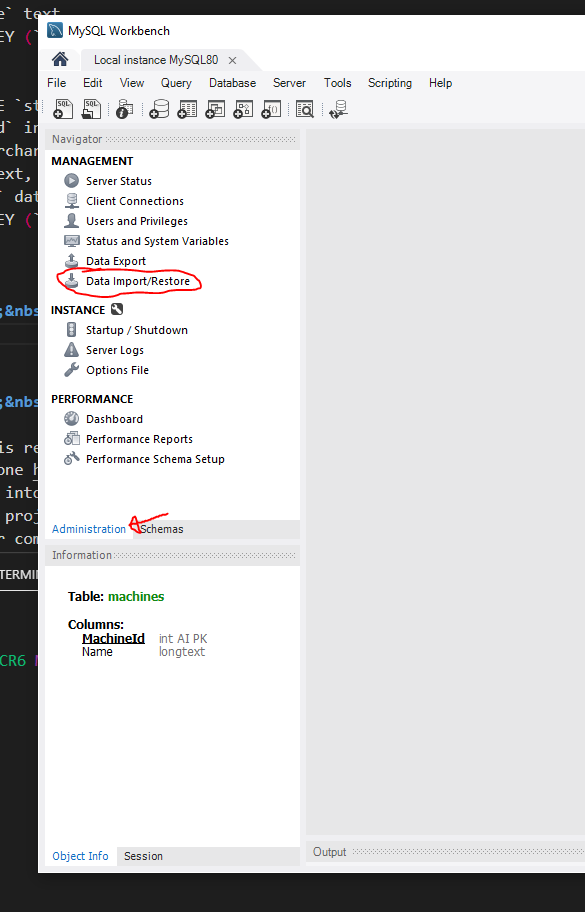
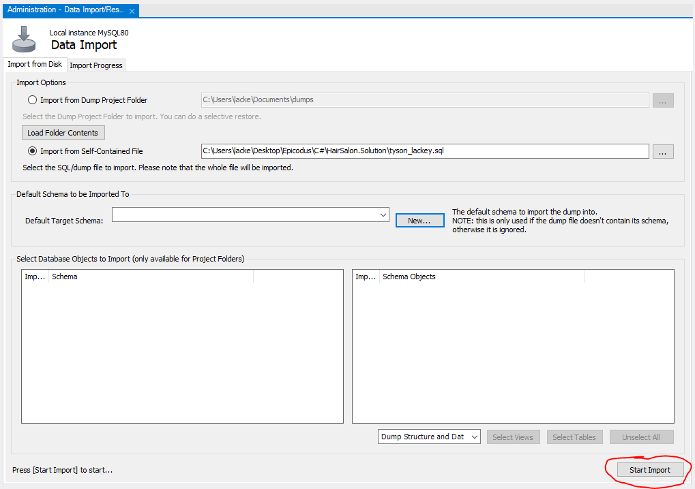

<h1 align="center"><strong>Animal Shelter API</strong></h1>

<h4 align="center"><em>API and associated database to track animals in a Shelter</em></h4>


##### __Created:__ 8/21/2020
##### __Last Updated:__ 8/21/2020 
##### By _**Tyson Lackey**_  


## Description
 

## Setup/Installation Requirements

##### &nbsp;&nbsp;&nbsp;&nbsp;&nbsp;&nbsp;Open via Bash/GitBash:

1. Clone this repository onto your computer:
    "git clone https://github.com/Lackeyt/AnimalShelterApi.Solution"
2. Navigate into the "AnimalShelterApi.Solution" directory in Visual Studio Code or preferred text editor:
3. Open the project by typing "code ." while in the previous directory in your terminal.
4. Open your computer's terminal and navigate to the directory bearing the name of the program and containing the top level subdirectories and files.
5. Enter the command "dotnet build" in the terminal and press "Enter".
6. Enter the command "dotnet ef migrations add initial"
7. Enter the command "dotnet ef database update"
6. Enter the command "dotnet watch run" in the terminal and press "Enter".


##### &nbsp;&nbsp;&nbsp;&nbsp;&nbsp;&nbsp; Configue MySQL Workbench Database using database import:
1. In the Administration window of SQL Workbench, select 'Data Import/Restore' <br>
<br>
2. Select 'Import from self-contained file" from the data import window.<br>
<br>
3. Navigate to the file path titled tyson_lackey.sql in the Solution file.<br>
<br>
4. Under 'Default Schema to be Imported To', click the "new" button.<br>
<br>
5. Name the schema 'Travel_Api' and click "ok"<br>
<br>
6. Click 'Start Import'<br>
<br>
7. reopen the schemas tab, right click and select "refresh all".<br>

## API Documentation

### &nbsp;&nbsp;&nbsp;&nbsp;&nbsp;&nbsp;Available API Routes:

  * Animal List [Type: GET]: http://<span></span>localhost:5000/api/animals...
    * Returns a list of animals based on parameters below
    * Parameters:
      - Name (string [max 20 characters])
      - Type (string [max 20 characters])
      - Description (string [max 20 characters])

  * Random Animal [Type: GET]: http://<span></span>localhost:5000/api/animals/random
    * Returns a list of animals based on parameters below
    * Parameters:
      - n/a

  * Create Animal [Type: POST]: http://<span></span>localhost:5000/api/animals...
    * Creates a new Animal records, all fields required for valid entry.
    * Parameters:
      - Name (string [max 20 characters])
      - Type (string [max 20 characters])
      - Description (string [max 20 characters])

  * Animal Info [Type: GET]: http://<span></span>localhost:5000/api/animals/{id}
    * Returns a single animal record associated to the route id
    * Parameters:
      - id (integer) *required

  * Animal Update [Type: PUT]: http://<span></span>localhost:5000/api/animals/{id}
    * Updates a single animal record associated to the route id
    * Parameters:
      - id (integer) *required

  * Animal Delete [Type: DELETE]: http://<span></span>localhost:5000/api/animals/{id}
    * Deletes a single animal record associated to the route id
    * Parameters:
      - id (integer) *required

### &nbsp;&nbsp;&nbsp;&nbsp;&nbsp;&nbsp; Using the API:

  * Using a platform like Postman, specify the type of request (GET/POST/PUT/DELETE)
  * Enter the appropriate URL for your route above.
  * Define any optional parameters if available and click "send"

      ```
      Call:
        Type: GET
        http://localhost:5000/api/animals?type=cat&color=black

      Response (JSON, format: pretty):
        {
          "AnimalId": 5,
          "Name": "Steve",
          "Type": "cat",
          "Color: "black",
          "Description": "Steve's crazy"
        }
      ```
      
      ```
      Call:
        Type: GET
        http://localhost:5000/api/animals/random
      
      Response (JSON, format: pretty):
        {
          "AnimalId": 3,
          "Name": "King Leonidas",
          "Type": "hedgehog",
          "Color: "grey",
          "Description": "Leo like's to eat cat food and nibble on shoes"
        }
      ```

      ```
      Call:
        Type: PUT
        http://localhost:5000/api/animals/5

      Response:
        n/a
        -DB record modified-
      ```

### &nbsp;&nbsp;&nbsp;&nbsp;&nbsp;&nbsp; Swagger UI use:

  * API calls can be used through the swagger UI
    http://<span></span>localhost:5000/

## Known Bugs

* n/a

## Support and contact details

* Discord: TysonL#4409
* Email: lackeyt90@gmail.com


## Technologies Used

* Visual Studio Code
* C#
* Swagger
* MySQL Workbench
* Entity Framework
* .NET Core

### License

Copyright (c) 2020 **_Tyson Lackey_**

This software is licensed under the MIT license.